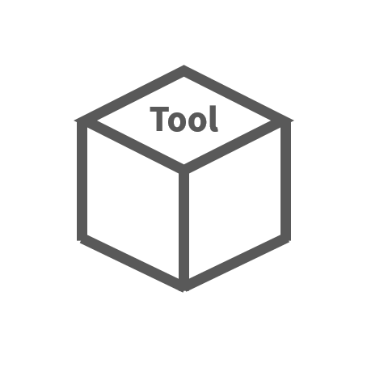

ASR560X
=======================
`English <https://asriot.readthedocs.io/en/latest/>`_

这些是 `ASR <http://www.asrmicro.com/index>`_ IoT 560X 系列产品的文档。

==================  ==================  ==================
|芯片规格|_         |硬件介绍|_           |烧录工具介绍|_
------------------  ------------------  ------------------
`芯片规格`_         `硬件介绍`_           `烧录工具介绍`_
------------------  ------------------  ------------------ 
|演示工程|_         |软件快速入门|_         |FAQ|_
------------------  ------------------  ------------------
`演示工程`_         `软件快速入门`_         `FAQ`_
------------------  ------------------  ------------------ 
|认证|_        
------------------  ------------------  ------------------ 
`认证`_      
==================  ==================  ==================

.. _芯片规格: 芯片规格/index.html

.. _硬件介绍: 硬件介绍/index.html

.. _烧录工具介绍: 烧录工具介绍/index.html

.. _演示工程: 演示工程/index.html

.. _软件快速入门: esp8266+arduino/index.html

.. _FAQ: FAQ/index.html

.. _认证: 认证/index.html
